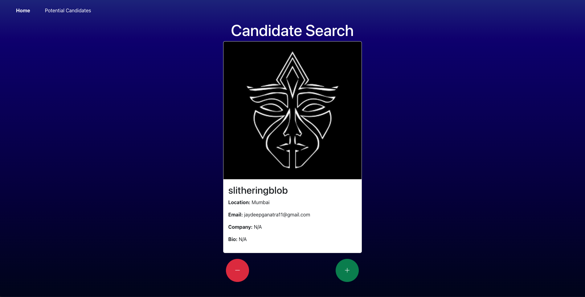
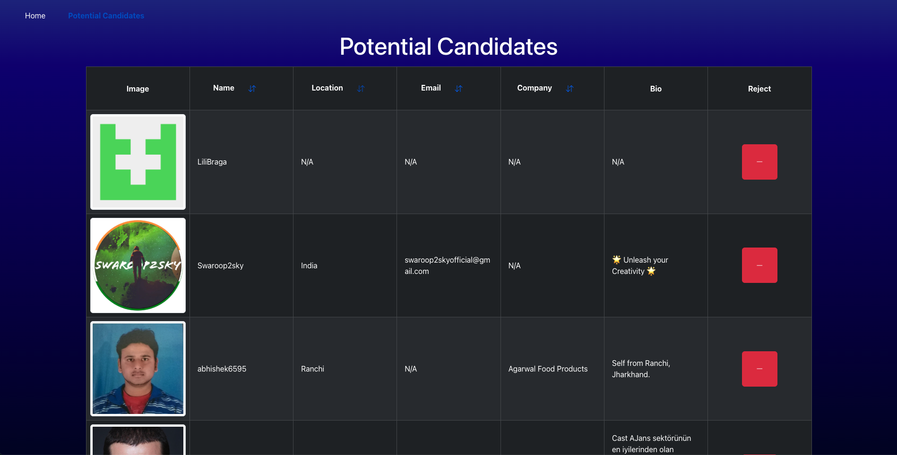

# Candidate Search Tool


## Description 

The Candidate Search Tool is a web-based application that utilizes the GitHub API to help employers search for and manage potential candidates for hiring. This application provides an intuitive user interface to browse through candidate profiles, save potential candidates, and reject unsuitable ones. It integrates features like local storage to persist saved candidates, dynamic sorting, and responsive design. This tool is designed to simplify the hiring process and ensure an excellent user experience.

## Table of Contents 

- [Installation](#installation)
- [Usage](#usage)
- [Credits](#credits)
- [License](#license)
- [Contributing](#contributing)
- [Tests](#tests)
- [Questions](#questions) 

## Installation 

To install and run the Candidate Search Tool locally, follow these steps: 

1. **Clone the Repository**

    `git clone https://github.com/Connorldailey/Candidate-Search.git`

2. **Navigate to the Project Directory**

    `cd Candidate-Search`

3. **Install Dependencies**

    `npm install`

4. **Set Up Environment Variables**

    - Create a `.env` file in the root directory.
    - Add your GitHub Personal Access Token in the `.env` file:

        ```
        VITE_GITHUB_TOKEN=your-github-token
        ```
    - If you need help generating a GitHub Personal Access Token, refer to the [GitHub Documentation](https://docs.github.com/en/authentication/keeping-your-account-and-data-secure/creating-a-personal-access-token).

5. **Run the Application**

    `npm start`

If the application does not open in your web browser by default, navigate to `http://localhost:3000`.

## Usage 

To use the application, visit the [live site](https://candidate-search-a50r.onrender.com).s

### How to get started

1. **Home Page:**

    When the page loads, information about one candidate is displayed. Click the `+` button to save the displayed candidate to the list of potential candidates and move to the next profile. Click the `-` button to skip the current candidate without saving. If there are no candidates left to review, a message is displayed.



2. **Potential Candidates Page:**

    Displays a list of previously saved potential candidates. Sort candidates by name, location, or company in ascending or descending order. Click the red Reject button to remove a candidate from the list. The list updates in real-time. Saved candidates are stored in local storage, ensuring the data persists across page reloads. If there are no candidates to display, a message is shown on the page.




## Credits 

- **GitHub API:** [GitHub REST API Docoumentation](https://docs.github.com/en/rest/users/users?apiVersion=2022-11-28) 
    - For providing the data about candidates.
- **Bootstrap Icons:** [Bootstrap Icons Documentation](https://icons.getbootstrap.com/)
    - For intuitive icons for sorting and candidate actions.
- **Bootstrap Documentation:** [Bootstrap Docs](https://getbootstrap.com/docs/5.3/getting-started/introduction/)
    - Referenced for implementing responsive design.
- **Sorting Strings in Objects:** [Stack Overflow](https://stackoverflow.com/questions/1129216/sort-array-of-objects-by-string-property-value)
    - For insights on sorting arrays of objects by string property values.

### Acknowledgments:

Special thanks to The Ohio State University Coding Bootcamp for providing foundational resources and support throughout the development of this project.

## License 

This project is licensed under the MIT License - see the [MIT License](https://opensource.org/licenses/MIT) for details. 

## Contributing 

To contribute to the project, submit a pull request with your proposed changes.

## Tests 

Currently, this project does not include automated tests.

## Questions 


If you have any questions about this project, feel free to reach out: 

- **GitHub:** [connorldailey](https://github.com/connorldailey)
- **Email:** connorldailey@gmail.com

